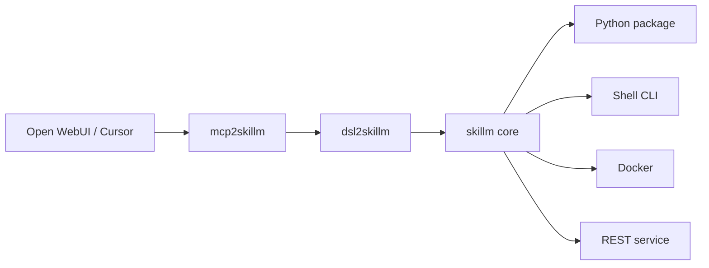

# skillm

Uniwersalna warstwa **skill** dla AI przez protokół MCP — reużycie gotowych paczek Python, usług Docker, dowolnego CLI, API REST bez ręcznej integracji każdego narzędzia.

Schemat zgodny z [CONTROL_LAYER](https://github.com/oqlos/doql/blob/main/packages/CONTROL_LAYER_PROMPT.template.md): cienkie adaptery (`mcp2*`, `rest2*`, `cli2*`) delegują do `dsl2skillm.dispatch()`.

## Szybki start

```bash
cd /home/tom/github/semcod/skillm
bash install-dev.sh

# CLI
cli2skillm exec 'LIST FILE app.skillm.yaml'
cli2skillm exec 'INVOKE skillm://skill/echo-python FILE app.skillm.yaml'

# MCP (stdio — dla Cursor, Open WebUI, Claude Desktop)
mcp2skillm serve

# REST
rest2skillm serve --port 8216
curl -s http://127.0.0.1:8216/health
```

## Architektura



## Manifest skilli (`app.skillm.yaml`)

```yaml
version: "1"
skills:
  echo-python:
    type: python
    entry: skillm.examples.echo:run
    args: ["hello"]

  my-cli:
    type: cli
    command: curl
    args: ["-s", "https://httpbin.org/get"]

  my-docker:
    type: docker
    image: hello-world:latest

  my-api:
    type: rest
    url: http://127.0.0.1:8210/health
    method: GET

  other-mcp:
    type: mcp
    command: mcp2doql
    args: ["serve"]
```

## DSL (przykłady)

```text
LIST FILE app.skillm.yaml
QUERY skillm://skill/echo-python FILE app.skillm.yaml
VALIDATE app.skillm.yaml
HEALTH skillm://skill/echo-python FILE app.skillm.yaml
INVOKE skillm://skill/echo-python FILE app.skillm.yaml ARGS '["world"]'
REGISTER my-tool TYPE cli WITH {"command":"date","args":["-u"]}
PATCH skillm://skill/my-tool WITH {"description":"updated"}
UNREGISTER my-tool
RESOLVE "python echo skill"
```

## Paczki

| Paczka | Port / transport | Opis |
|--------|------------------|------|
| `skillm` | — | Registry, invoke, validate |
| `dsl2skillm` | — | Bus CQRS + Schema + Protobuf |
| `uri2skillm` | — | `skillm://cmd/...` → DSL |
| `nlp2skillm` | — | NL → DSL |
| `cli2skillm` | stdio REPL | `shell`, `exec`, `run` |
| `mcp2skillm` | MCP stdio | Narzędzia `skillm_*` |
| `rest2skillm` | **8216** | `POST /v1/dsl` |

Szczegóły: [`packages/README.md`](packages/README.md).

## Open WebUI

Instrukcja integracji MCP: [`examples/open-webui/README.md`](examples/open-webui/README.md).

## Testy

```bash
pytest packages/ -q
```

## Licencja

Apache-2.0 — see [LICENSE](LICENSE).
