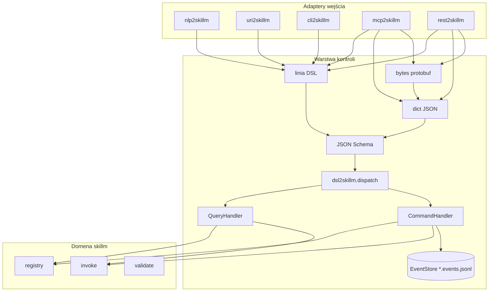

# skillm packages

Warstwa kontroli dla uniwersalnego reużycia skilli przez MCP/REST/CLI.

## Paczki

| Paczka | Rola |
|--------|------|
| `skillm` | Core — registry, invoke, validate |
| `dsl2skillm` | DSL + CQRS bus + Schema + Protobuf |
| `uri2skillm` | `skillm://` → linia DSL |
| `nlp2skillm` | NL → DSL |
| `cli2skillm` | Shell REPL / exec |
| `mcp2skillm` | Serwer MCP (stdio) |
| `rest2skillm` | REST API (:8216) |

## Diagram przepływu



## Instalacja dev

```bash
bash install-dev.sh
pytest packages/ -q
```
